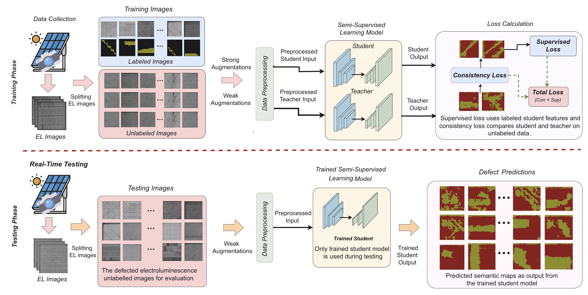

# PV-S3
<p align="center">

  <h2 align="center"> Advancing Automatic Photovoltaic Defect Detection using Semi-Supervised Semantic Segmentation of Electroluminescence Images</h2>
  <p align="center">
    <a href="https://abj247.github.io/"><strong>Abhishek Jha</strong></a><sup>1</sup>
    ·
    <a href="https://www.crcv.ucf.edu/person/rawat/"><strong>Yogesh Rawat</strong></a><sup>2</sup>
    ·
    <a href="https://ai.ucf.edu/person/shruti-vyas/"><strong>Shruti Vyas</strong></a><sup>2</sup>
    
</p>

<p align="center">
    <sup>1</sup> Delhi Technological University · <sup>2</sup>University of Central Florida
</p>
   <h3 align="center">

   [](https://arxiv.org/abs/2404.13693/) [](https://pv-s3.github.io)
  <div align="center"></div>
</p>





## Abstract:

Photovoltaic (PV) systems allow us to tap into all abundant solar energy, however they require regular maintenance for high efficiency and to prevent degradation. Traditional manual health check, using Electroluminescence (EL) imaging, is expensive and logistically challenging which makes automated defect detection essential. Current automation approaches require extensive manual expert labeling, which is time-consuming, expensive, and prone to errors. We propose PV-S3 (Photovoltaic-Semi Supervised Segmentation), a Semi-Supervised Learning approach for semantic segmentation of defects in EL images that reduces reliance on extensive labeling. PV-S3 is a Deep learning model trained using a few labeled images along with numerous unlabeled images. We evaluate PV-S3 on multiple datasets and demonstrate its effectiveness and adaptability. With merely 20% labeled samples, we achieve an absolute improvement of 9.7% in IoU, 13.5% in Precision, 29.15% in Recall, and 20.42% in F1-Score over prior state-of-the-art supervised method (which uses 100% labeled samples) on UCF-EL dataset (largest dataset available for semantic segmentation of EL images)showing improvement in performance while reducing the annotation costs by 80%.


## Weights

- PV-S3 20% labelled weight: https://drive.google.com/file/d/1b_sIVyVivgDUFDIVlXSVhgQj5gpsh2X-/view?usp=sharing
- Backbone weight for Resnet in Deeplabv3+: https://drive.google.com/file/d/11ro2qP4uPjHPVCefF1DUMBIru_bMhroA/view?usp=sharing

## Acknowledgements

This work is inspired and modified upon the work from [PS-MT](https://github.com/yyliu01/PS-MT) which is the implementation of [Perturbed and Strict Mean Teachers for Semi-supervised Semantic Segmentation](https://arxiv.org/pdf/2111.12903). The computational resources for this work are taken from the Center for Research in Computer Vision (CRCV), University of Central Florida.


### Reference Links

1. Liu, Yuyuan, et al. "Perturbed and strict mean teachers for semi-supervised semantic segmentation." Proceedings of the IEEE/CVF conference on computer vision and pattern recognition. 2022..[pdf](https://arxiv.org/abs/2101.05436)
2. Fioresi, Joseph, et al. "Automated defect detection and localization in photovoltaic cells using semantic segmentation of electroluminescence images." IEEE Journal of Photovoltaics 12.1 (2021): 53-61. [UCFSolar Dataset](https://github.com/ucf-photovoltaics/UCF-EL-Defect)
3. Benchmark datasets for defect detection in EL images of solar cells using semantic segmentation [refered as CSB Dataset](https://github.com/TheMakiran/BenchmarkELimages)
4. Pratt, Lawrence, Jana Mattheus, and Richard Klein. "A benchmark dataset for defect detection and classification in electroluminescence images of PV modules using semantic segmentation." Systems and Soft Computing 5 (2023): 200048.
5. Pratt, Lawrence, Devashen Govender, and Richard Klein. "Defect detection and quantification in electroluminescence images of solar PV modules using U-net semantic segmentation." Renewable Energy 178 (2021): 1211-1222.

### Citation

Pleass cite this research in your publication if it helps your project

```bibtex
@article{jha2025advancing,
  title={Advancing automatic photovoltaic defect detection using semi-supervised semantic segmentation of electroluminescence images},
  author={Jha, Abhishek and Rawat, Yogesh and Vyas, Shruti},
  journal={Engineering Applications of Artificial Intelligence},
  volume={160},
  pages={111790},
  year={2025},
  publisher={Elsevier}
}
```

